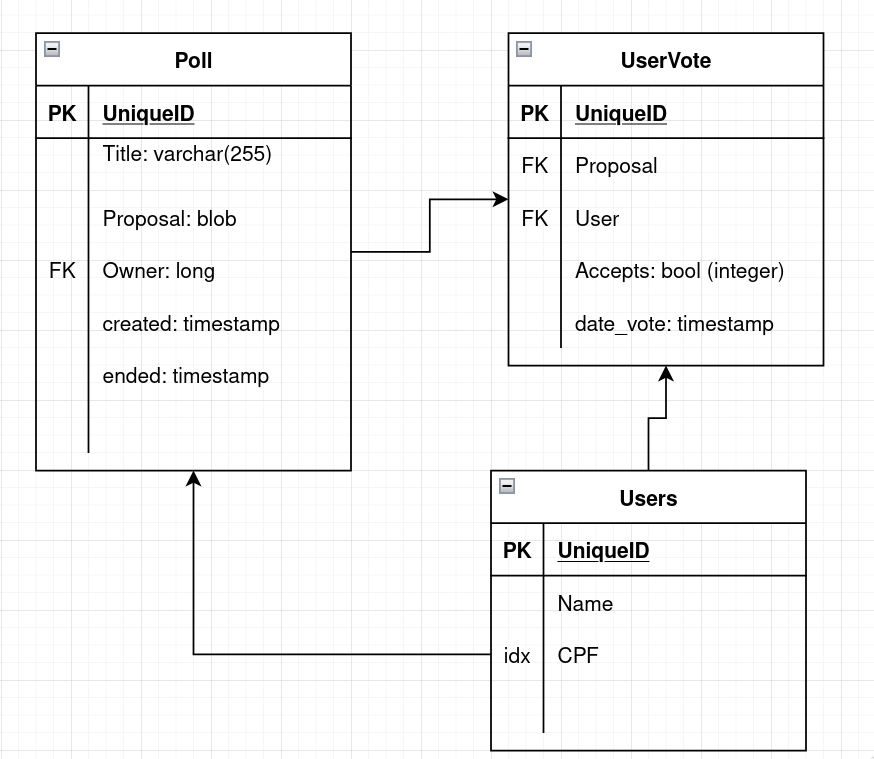

# Notas de implementação 

## Banco de dados
### Modelo

Dado o problema, proponho um modelo simplificado, focado nos elementos relevantes, como se segue:

- Users
  - id
  - nome
  - cpf (indexado)
- Poll
  - id
  - titulo
  - descrição (blob)
  - data de criação (timestamp)
  - data de finalização (timestamp)
- UserVotes
  - id
  - userId (fk)
  - pollId (fk)
  - accepted (boolean (integer no caso de oracle))
  - data do voto

Para visualização, segue um diagrama

Acredito ter destilado os pontos essenciais do problema (um usuário faz uma proposta,
outros concordam ou não), mas reconheço que se há possibilidades de expansão, como:
- outras posibilidades de voto,
- inclusão de links e imagens no comentário da proposta
  - (imagens já exige uma solução de arquitetura mais aprimorada, com uso de buckets S3 talvez),
- outras informações relacionadas ao usuario que podem influenciar na possibilidade de ele votar.

### H2
Visando facilitar a prototipação e testes, optei por um banco H2, instanciado em
tempo de execução, e usando a lib Spring JPA para interface com o banco.
O banco H2 é instanciado baseado no modelo implementado em Java, de modo que posso 
trabalhar numa linguagem familiar, abstraindo os detalhes para a biblioteca e apenas 
inserindo dados no script [data.sql](../src/main/resources/data.sql) para teste.
Para cumprir o requisito de persistência entre execuções do protótipo, a base é salva 
em arquivo, na pasta [db](../db), e na ausência deste, um arquivo novo é criado.

Para um ambiente de teste com objetivo de homologação, seria ideal a implementação 
de um banco real, com algum SGBD robusto e que aguentasse múltiplas conexões em 
paralelo, e com versionamento via Flyway.

****

## Api
### Widgets
Ao analisar a UI proposta, nota-se um forte acoplamento entre a representação do 
objeto em tela com a representação do objeto de negócios, além de haver uma forte
dependência de métodos `POST`. Desta forma, considero que padrão REST não é aplicável 
(pelo menos não sem um acordo com front-end, o que é fora do escopo deste desafio),
e optei por isolar os endpoints realcionados a visualização em um recurso próprio `/ui`.
Por consequência, deixei os recursos específicos dos objetos de
domínio para chamadas que de fato informam novos dados (nova iniciativa e voto).

A imagem a seguir apresenta, de forma um tanto crua, a jornada de usuario proposta.

Em outra nota de desenvolvimento, conforme implemento elementos de tela, noto uma grande
duplicação de elementos parecidos, mas nao identico. Fica como objetivo 
reduzir a duplicação antes da entrega.
Outro erro notado foi a implementação de uma tela generica, que comporta tanto
formularios quanto seleções, que apesar de ser interessante a possibilidade de 
colocar botões de voltar numa seleção, não é previsto no design. Uma segunda meta
de desenvolvimento é separar estas telas apropriadamente.

Conforme avanco o desenvolvimento, não posso deixar de notar que a implementacão de telas 
no back end, da forma como optei por fazer, tráz pontos negativos de arquitetura, os quais
tento lidar de forma adequada (mas preferia um outra solucão de API que eliminasse a necessidade disso).
Especificamente, estou tratantdo o estado da sessão do usuário como elemento de backend, incluindo e removendo
elementos extras do body das requests que retornam como forma de permitir uma jornada fluída.
Entretanto, o custo disso é manutenibilidade do código, uma vez que a cada componente do pacote `Screen`
tenho que gerenciar estes elementos, remover os que não são necessários e incluir outros.

### Async
Visando oferecer uma experiencia aprimorada para o usuario, o ideal seria uma implementação de 
asincronicidade quando possível, fazendo uso da interface _Completable Future_. Além da 
possiblidade de processar elementos aos poucos e de forma independente,
esta interface possibilita de isolar o tratamento de exeções em lambdas, 
de modo que o tratamento fica proximo do elemento que o chama, e não num handler a parte.

Entretanto, dado o acoplamento com elementos de UI na solucão proposta, optei por não usar esta
alternativa, uma vez que o mapeamento de telas está atrelado a informacões de estado dos componentes de
negócio. Reconheco o custo de performance nesta solucão, seria necessário um acordo mais elaborado 
com o front.

### Tratamento de excecões
Para o tratamento de excecão, pensando em manter uma experiencia de usuario agradável,
implementarei um tratamento baseado em handlers como propostos pelo framework.
Faco essa escolha pensando no acoplamento entre as telas e a API, que, na implementacão
que escolhi, impede a mistura de telas de FORMULÁRIO e SELECÃO.

****

Muito obrigado pelo tempo dedicado na avaliação deste projeto!
